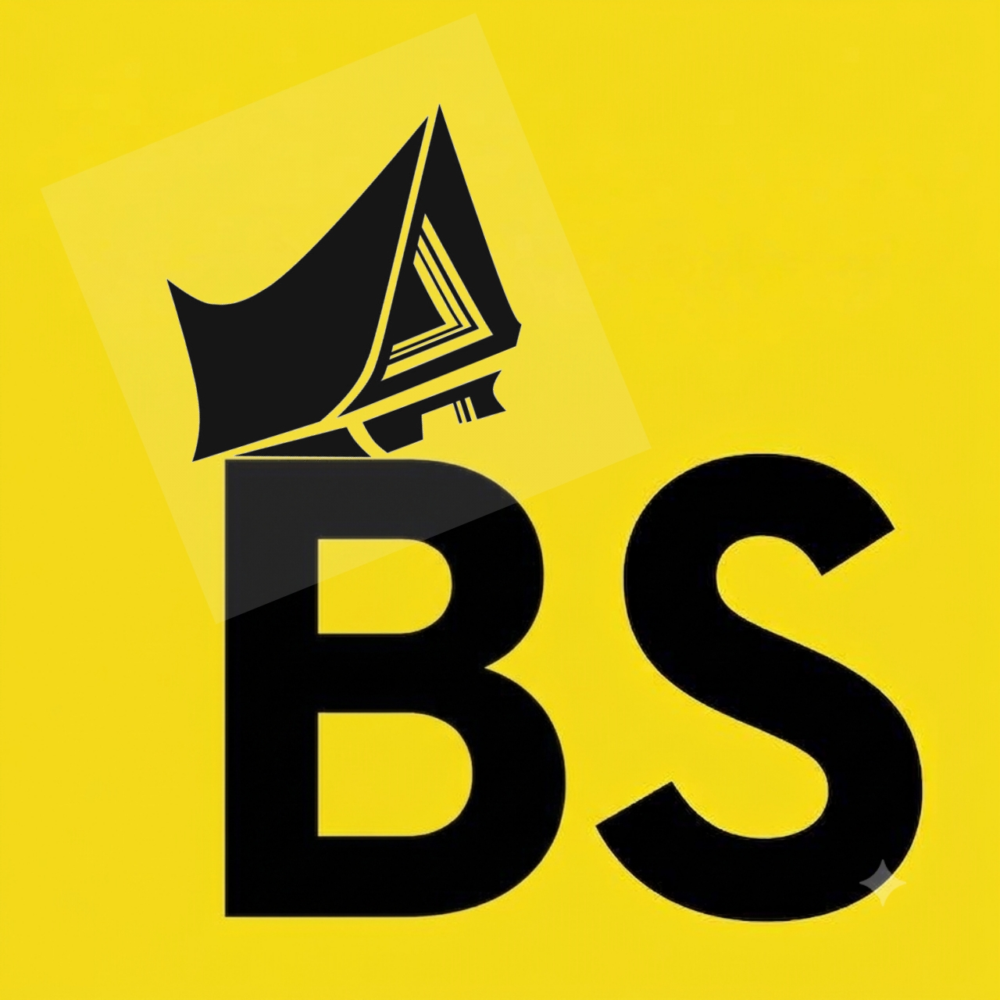

<p align="center">
  
</p>

<h1 align="center">🌾 Batakscript</h1>

<p align="center">
  <b>Bahasa pemrograman berbasis sintaks lokal Batak yang ditranspile langsung ke JavaScript / Node.js.</b>
</p>

<p align="center">
  <a href="https://www.npmjs.com/package/@fahrul120204/batakscript"></a>
  <a href="https://www.npmjs.com/package/@fahrul120204/batakscript"></a>
  <a href="#license"></a>
</p>

---

## 🚀 Fitur Utama

- ⚡ **Eksekusi Cepat:** Berjalan di atas Node.js Runtime.
- 📜 **Format Berkas `.horas`:** Ekstensi kustom untuk kode Batakscript.
- 🎯 **Sintaks Intuitif:** Menggunakan frasa bahasa Batak sehari-hari (`paboa`, `bahen`, `molo`, `dohot`).
- 📦 **Global CLI:** Dapat dipasang dan dijalankan dari terminal mana saja.

---

## 📥 Instalasi

Pasang paket secara global melalui **npm**:

```bash
npm install -g @fahrul120204/batakscript
